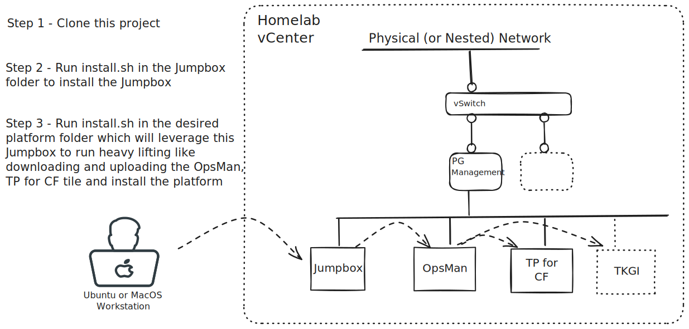

## Tanzu Lab Installation Helpers
 Helpers to enable faster setup and management of Tanzu Lab platforms in a vSphere environment.

## 1. Clone this Repository
It's assumed that you will clone this repository for each unique homelab environment. For example you may
have an `env` directory in your home folder from which you clone this repo to a directory named for your
`homelab` environment. 

## 2. Create a Jumpbox
The Jumpbox is required by all follow on platform installation helpers below, so get
started by first [creating a Jumpbox](./jumpbox/README.md). 

## 3. Platform Installation Helpers
With a Jumpbox created, follow one of the helpers below to setup a platform.

* ### Tanzu Platform for Cloud Foundry (TPCF) on vSphere NSX-T & TKGI & GenAI for TPCF
    [Automation to install TPCF (small footprint runtime), TKGI on a vSphere NSX-T deployment type.](./tpcf_nsx/README.md)

* ### Tanzu Platform for Cloud Foundry (TPCF) on vSphere VDS  & GenAI for TPCF
    [Automation to install TPCF (small footprint runtime) on a vSphere VDS deployment type.](./tpcf_vds/README.md)

* ### Harbor
    [Automation to install Harbor in your homelab.](./harbor/README.md)

 

___

### Credits
Authors, co-authors of the original 'h2o helpers' scripts