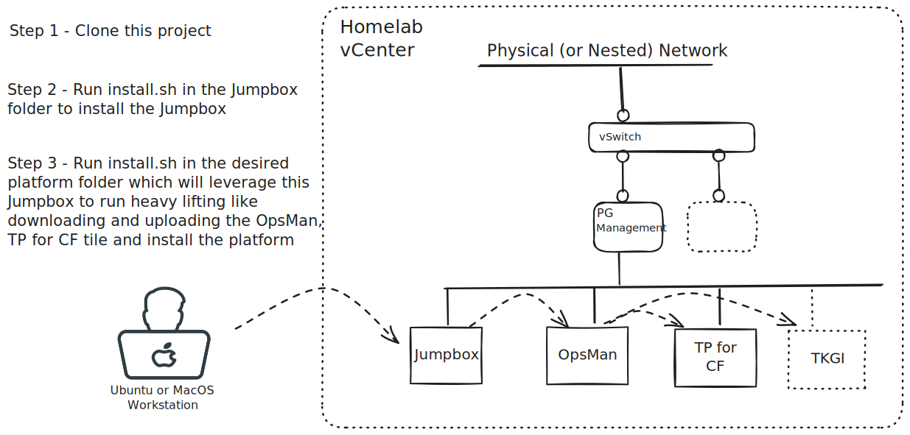

# Jumpbox
Automation to create a Jumpbox in your homelab environment.

The jumpbox is a prerequisite for other installation scripts (Harbor, TPCF, TKGI ..)



### Prerequisites

vCenter 7.x or superior, one Port Group (here "Management" as default value) with Internet access,  [govc], [ytt] installed and available on your PATH in your local Ubuntu or MacOS workstation.

## Create Jumpbox
This script assumes you're running it from a Mac or Linux workstation connected
to your vCenter. Before running the Jumpbox configure or install script to ensure
you have [govc], [ytt] installed and available on your PATH.

To create a jumpbox, create a `jumpbox.config` file from a copy of the `jumpbox.config_template` template, edit the values as needed with your environment variables and then execute the install:

```sh
./install.sh
```

This will download the latest Ubuntu Focal OVA and spin up a jumpbox VM in
vSphere at the IP address you defined in the `jumpbox.config` file.


## Configuration

Edit the values as needed in the `jumpbox.config` file

```bash
# Required
homelab_domain='homelab.loc'
vcenter_host='vcenter.homelab.loc'
vcenter_username='administrator@vsphere.local'
vcenter_password='VMware1!'
vcenter_datacenter='Homelab-Datacenter'
vcenter_cluster='Homelab-Cluster'
vm_network='Management'
datastore='vsanDatastore'
jumpbox_ip='10.50.0.10'
jumpbox_gateway='10.50.0.1'
jumpbox_dns='10.50.0.100'

# Optional - overrides defaults
jumpbox_netmask='255.255.255.0'
vm_name='jumpbox'
root_disk_size='80G'
ram='8192'
```

- `homelab_domain` is the domain suffix your homelab.
- `vcenter_host` is the FQDN or IP of your vCenter.
- `vcenter_username` is the administrator username of your vCenter.
- `vcenter_password` is the administrator password of your vCenter.
- `vcenter_datacenter` is the datacenter in your vCenter where the Jumpbox is deployed.
- `vcenter_cluster` is the cluster in your vCenter where the Jumpbox is deployed.
- `vcenter_password` is the administrator password of your vCenter.
- `jumpbox_ip` is the IP address of the Jumpbox.
- `jumpbox_netmask` is the network mask used by the Jumpbox.
- `jumpbox_gateway` is the network gateway used by the Jumpbox.
- `jumpbox_dns` is the comma delimited list of DNS servers used by the jumpbox.
- `vcenter_host` is the vCenter host name that is used by govc to spin up the jumpbox.
- `vm_name` is the VM name, by default Jumpbox.
- `vm_network` is the network name the Jumpbox is attached to, by default Management.
- `root_disk_size` is the size of the Jumpbox HDD, by default 80G.
- `datastore` is the vCenter datastore name.
- `ram` is the amount of RAM to give the Jumpbox, by default this is 8192 (8G).

After completing your edits, run the install script:
```sh
./install.sh
```


## SSH to Jumpbox

To SSH into the Jumpbox 

```bash
ssh -F .ssh/config jumpbox
```


## Destroy the Jumpbox

To destroy the Jumpbox run

```bash
./destroy.sh
```


[govc]: #govc-installation
[ytt]: #ytt-installation


## Dependencies

#### 'govc' installation

https://github.com/vmware/govmomi/blob/main/govc/README.md

```sh
curl -L -o - "https://github.com/vmware/govmomi/releases/latest/download/govc_$(uname -s)_$(uname -m).tar.gz" | tar -C /usr/local/bin -xvzf - govc
```

#### 'ytt' installation

https://github.com/vmware-tanzu/carvel-ytt

Linux
```sh
wget -q https://github.com/vmware-tanzu/carvel-ytt/releases/download/v0.51.1/ytt-linux-amd64
sudo install ytt-linux-amd64 /usr/local/bin/ytt 
rm -f ytt-linux-amd64
```

MacOS
```sh
wget -q https://github.com/vmware-tanzu/carvel-ytt/releases/download/v0.51.1/ytt-darwin-amd64
sudo install ytt-darwin-amd64 /usr/local/bin/ytt 
rm -f ytt-darwin-amd64
```

